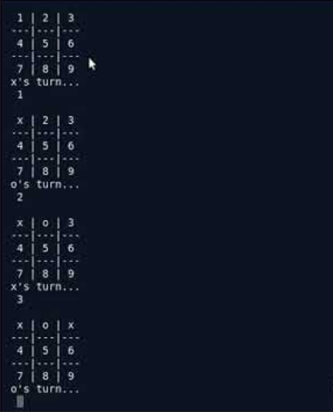

# Tic Tac Toe
Welcome to Tic Tac Toe - a classic game for two people. You can either win, lose or draw!

## Visual 

## Directions
- Find a friend to play with!
- Enter in a number from 1 to 9 (determines the position of your X or O). Make sure to enter in a number within the value range.
- If you are able to get 3 in a row..you win! If no one is able to, a draw is reached.

## Project Details
This project was created in Visual Studio 2019 within a console application. It uses different instances of classes, which are then used by other classes and then produce data. The Objects were:

- Board: Holds the matrix of numbers. Able to display the board as well.
- Game: Starts up the game and creates instances of a Board and both players.
- Player: two are created during every game in which they are given a turn to be able to make their move.
- Position: Position is a coordinate that is used to determine two things:
    1. Where to place the X or O when a number is given
    2. Determine if there is a winner from the position's coordinates checked against some set coordinates.